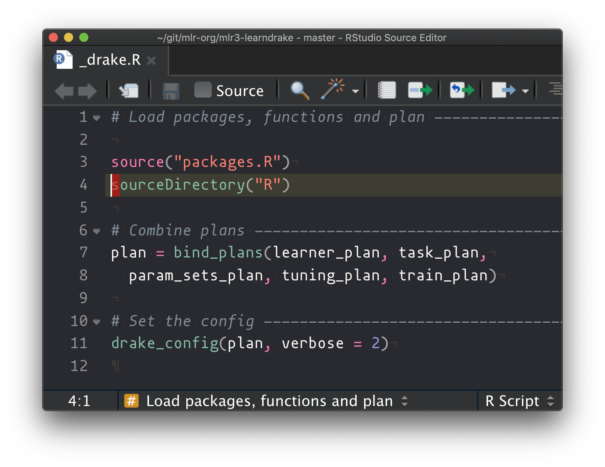
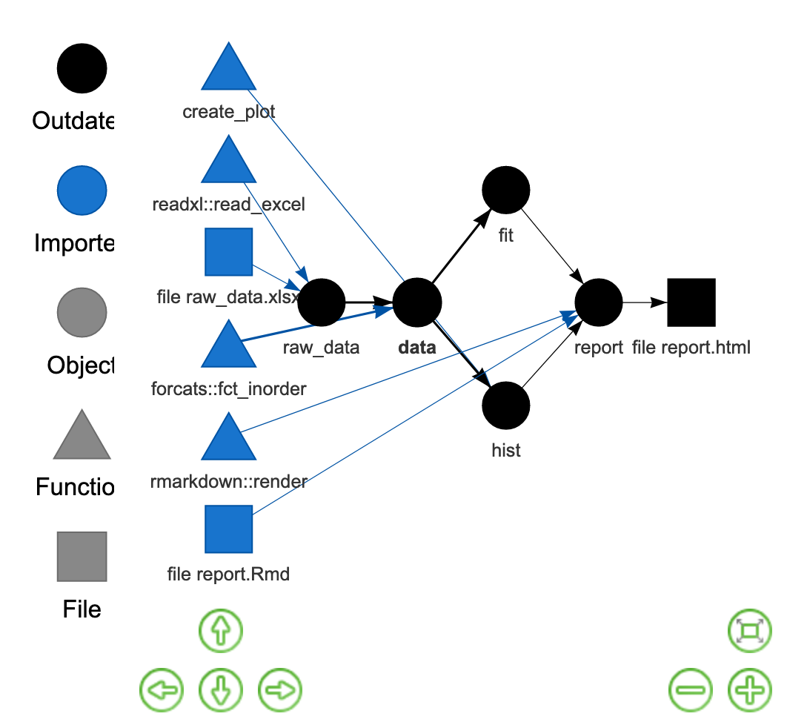

```{r setup, include=FALSE}
knitr::opts_chunk$set(
  fig.width = 10, fig.height = 6, fig.retina = 2,
  warning = FALSE, message = FALSE
)
```


class: left bottom hide-count
background-image: url(assets/images/bench-accounting-xxeAftHHq6E-unsplash.jpg)
background-size: 100%
background-position: top
background-color: #eff0f2

<div class="talk-logo drake-logo"></div>

.talk-meta[
.talk-title[
# Reproducible machine learning workflows
]

.talk-author[
Patrick Schratz
]


.talk-date[
September 27th, 2019
]
]

---

class: top hide-count center middle

.f1.large[

.code.moffitt-blue[usethis::use_course("mlr-org/mlr3-learndrake")]
]

.f1.large[

[github.com/.moffitt-orange[mlr-org/mlr3-learndrake]](https://github.com/mlr-org/mlr3-learndrake)
]

.f2.silver.center.mt5[Find someone to sit next to and share laptops]

<br><br>

.small[
(_Slide style and content borrowed from [Garrick Aden-Buie](https://github.com/gadenbuie/drake-intro)_ `r icon::fa_rocket()`)
]

---

class: inverse center middle hide-count

## What is drake?

--


---

```{r messy-data-workflow, echo=FALSE, results="asis"}
messy_slides <- dir("assets/images/drawn", pattern = "messy.+jpg$", full.names = TRUE)

messy_slides_txt <- glue::glue("

class: hide-count animated fadeIn
background-image: url('{messy_slides}')
background-size: contain

---

")

cat(messy_slides_txt, sep = "")
```

class: middle
background-image: url('assets/images/drawn/messy-workflow-32.jpg')
background-size: contain

.f2.moffitt-bg-light-blue-o90.white.pa5.shadow-3[
* Will this work when I come back to it later?

* What happens if I re-run _everything_?

* Am I certain that the results are still valid?
]

---

```{r project-spectrum, echo=FALSE, results="asis"}
proj_slides <- dir("assets/images/drawn", pattern = "project.+jpg$", full.names = TRUE)

proj_slides_txt <- glue::glue("

class: hide-count animated fadeIn
background-image: url('{proj_slides}')
background-size: contain

---

")

cat(proj_slides_txt, sep = "")
```


```{r drake-intro, echo=FALSE, results="asis"}
drake_intro <- dir("assets/images/drawn", pattern = "drake-intro-\\d+[.]jpg$", full.names = TRUE)

drake_intro_txt <- glue::glue("

class: hide-count animated fadeIn
background-image: url('{drake_intro}')
background-size: contain

---

")

cat(drake_intro_txt, sep = "")
```


layout: true
class: animated fadeIn
background-image: url('assets/images/drake-infographic.svg')
background-size: 100%
background-position: 40% left

(_borrowed from [ropensci/drake](https://github.com/ropensci/drake)_)

---


.bg-white.h-100.w-80.fixed.o-90.cover-2-3[
<!-- Cover left two items of drake infographic -->
]

---

.bg-white.h-100.w-80.fixed.o-90.cover-3[
<!-- Cover left items of drake infographic -->
]

---

<!-- Full drake infographic -->

---
layout: false
class: inverse middle center

# drake Essentials

---
layout: false

# `_drake.R`

.flex[
.w-40[
The main settings file

- sources all R functions

- sources all "drake-plans" and binds them together

- sets the execution parameters in `drake_config()`

- called by `r_make()` at the start of every run
]

.w-70[

<center></center>

]
]

---

## .pkg[drake] "targets"

- _targets_ are simple R objects which **know their dependencies**

- _targets_ represent all intermediate or final results of your project

- _targets_ live in the **drake-cache** (`.drake` directory) and can from there be loaded into the global environment using `loadd()`

#### Advantages

- No need to use `saveRDS()`/`save()` anymore to store intermediate outputs

- Quick-load _targets_ under cursor in RStudio via addin

- visualize dependencies via `r_vis_drake_graph()`

---

# `r_vis_drake_graph()`

Shows how all _targets_ are connected

<center></center>

---

## How does drake help you in your daily work?

- Knows the execution order of your **complete** analysis
```r
r_vis_drake_graph()
```

- Enables **running** your complete project in **one call**
```r
r_make()
```

- Tracks metadata of each _target_ (runtime, etc.)

- If you make a substantial change downstream, all subsequent _targets_ will be updated (plots, tables, models, etc.)

---

## But wait, there's more!

There is a lot more that .pkg[drake] can do, including:

- [Predict total runtime](https://ropenscilabs.github.io/drake-manual/time.html#predict-total-runtime) of your plan

```r
r_predict_runtime()
```

- Support for [large plans](https://ropenscilabs.github.io/drake-manual/plans.html#large-plans) by using wildcards and functions `map()`, `cross()` and `combine()`

- [Parallel computation](https://ropenscilabs.github.io/drake-manual/hpc.html#parallel-backends) of _targets_ via packages

- .pkg[future] 

- .pkg[clustermq] (HPC)

- Support for many HPC schedulers (SLURM, SGE, PBS, LSF) via package .pkg[clustermq]

---

### Learn more with these resources

.flex[
.w-40.ph4[
Drake

* [User Manual](https://ropenscilabs.github.io/drake-manual/)
* [Package Docs](https://ropensci.github.io/drake/)
* [ropensci/drake](https://github.com/ropensci/drake)
* [drake-faq](https://ropenscilabs.github.io/drake-manual/faq.html)
* [wlandau/drake-examples](https://github.com/wlandau/drake-examples)
* [wlandau/learndrake](https://github.com/wlandau/learndrake)
* [mlr-org/mlr3-learndrake](https://github.com/mlr-org/mlr3-learndrake)
]
.w-60.ph4[
Functions

* [Advanced R: Functions](https://adv-r.hadley.nz/functions.html)
* [Functions - Nice R Code](https://nicercode.github.io/guides/functions/)
* [Programming with R: Creating Functions](https://swcarpentry.github.io/r-novice-inflammation/02-func-R/)
]
]

.small[
**Icons** by [Github octicons](https://octicons.github.com/) and the following [Noun Project](https://thenounproject.com/search/?q=Report&i=180805) icon creators:
[Kirby Wu, TW](https://thenounproject.com/search/?q=json&i=966215),
[Iga](https://thenounproject.com/search/?q=document&i=2711779),
[Lil Squid](https://thenounproject.com/search/?q=report&i=149914),
[Wichai Wi](https://thenounproject.com/search/?q=results&i=2294590),
[Nick Kinling](https://thenounproject.com/search/?q=detour&i=788361).

**Built with** [rmarkdown](https://rmarkdown.rstudio.com), [xaringan](https://slides.yihui.name/xaringan), [xaringanthemer](https://pkg.garrickadenbuie.com/xaringanthemer), [remark.js](http://remarkjs.com/), [tachyons.css](http://tachyons.io/), [animate.css](https://daneden.github.io/animate.css/)
]

---
layout: false

## Personal FAQ (1/2)

.small[
+ What is the difference between `drake::make()` and `drake::r_make()`?

> `r_make()` runs in a fresh R session via package .pkg[callr] and sources the config before every run. No need to source the config yourself and then run `make(config)`. See also [drake-manual/safer-interactivity](https://ropenscilabs.github.io/drake-manual/projects.html#safer-interactivity).

+ How do I parallelize code within targets?

> By passing `prework = quote(future::plan(future.callr::callr, workers = <n>))` or a similar parallel plan to `drake_config()` in `_drake.R`. Do not use `future::plan()` within scripts/functions.

+ I have no idea what the status of my running computation is. Is there a way to see it?

> Yes, either use `drake::progress()`, `drake::finished()` or `drake::failed()`. Optionally make the output more verbose using `drake::progress() %>% print(n = 200)`.
]

---
layout: false

## Personal FAQ (2/2)

.small[
+ Everything in the drake manual is forcing me to use functions but I am used to scripts mainly.
What is better with functions?

> Project structure and organization is eminently important. A function-based workflow enhances reproducibility and leads to a more clean project structure. See [this discussion](https://github.com/ropensci/drake/issues/994) for more information.

+ Is there a convenient way to load targets quickly?

> Yes! With the installation of .pkg[drake] there is an addin called "load targets under cursor" that lets you load the R object under your cursor when its bound to a keyboard shortcut. Mine is bound to "CTRL + L".

+ What about other addins and keyboard shortcuts?

> Take a look into the "Addins" menu in RStudio for a list of avaiable addins. I have the followings addin/shorcut bindings: `r_vis_drake_graph()` -> "CTRL + Shift + V"; `r_outdated()` -> "CTRL + Shift + O"; "load target under cursor" -> "CTRL +L"

]

```{css echo=FALSE}
.talk-logo {
  width: 200px;
  height: 231px;
  position: absolute;
  top: 25%;
  left: 12%;
}

.drake-logo {
  background-image: url('assets/images/drake-logo.svg');
  background-size: cover;
  background-repeat: no-repeat;
}

.talk-meta {
  font-family: Overpass;
  position: absolute;
  text-align: left;
  bottom: 10px;
  left: 25px;
}

.talk-author {
  color: #444;
    font-weight: bold;
  font-size: 1.5em;
  line-height: 1em;
}

.talk-date {
  color: #666;
    font-size: 1.25em;
  line-height: 0;
}

.icon-huge {
  position: relative; 
  top: 35px;
}

.icon-medium {
  position: relative; 
  top: 35px;
  widht: 50%;
}

.cover-2-3 {
  left: 33%;
}

.cover-3 {
  left: 66%;
}
```

```{r xaringanthemer, include=FALSE, eval=FALSE}
library(xaringanthemer)
duo_accent(
  outfile = here::here("slides/drake/assets/css/xaringanthemer.css"),
  primary_color        = "#00589A",
  secondary_color      = "#1c356b",
  inverse_header_color = "white",
  inverse_text_color   = "white",
  text_bold_color      = "#eb1455",
  text_font_size       = "26px",
  text_font_google     = google_font("Work Sans", "400", "300"),
  header_font_google   = google_font("Roboto Slab", "400"),
  code_font_google     = google_font("IBM Plex Mono", "300", "400"),
  text_font_weight     = "400",
  text_slide_number_font_size = "15px",
  table_row_even_background_color = "#f0f0f0",
  extra_fonts = list(
    google_font("Lora", "300", "300i", "400", "400i"),
    google_font("Overpass", "300", "600")
  ))
extra_css = list(
  ".remark-slide-content" = list(padding = "0px 70px 0 50px"),
  '.title-slide' = list(
    "text-align" = "left"
  ),
  ".title-slide" = list(
    "color" = "#eeeff1"
  ),
  ".title-slide h1" = list(
    "margin-bottom" = "4em"
  ),
  ".pkg" = list(
    "color"             = "#53804d",
    "font-weight"       = 300,
    "font-size"         = "95%",
    "font-family"       = "IBM Plex Mono",
    "padding"             = "1px 4px",
    "background-color"  = "#eff4ef",
    "border-radius"     = "4px",
    "border"            = "1px solid #82c878"
  ),
  ".muted" = list(
    "color" = "#777"
  ),
  ".hl" = list(
    "background-color" = "rgba(255, 255, 0, 0.5)",
    "padding"            = "1px 4px"
  ),
  ".footer" = list(
    "position" = "absolute",
    "bottom" = "3%",
    "left" = "5%",
    "opacity" = "75%"
  ),
  ".bordered" = list(
    "border" = "#777 solid 2px"
  ),
  ".top" = list(
    "vertical-align" = "top"
  ),
  "blockquote" = list(
    "font-family" = "Lora",
    "font-weight" = 400,
    "font-style" = "italic",
    "color" = "#777"
  ),
  ".large" = list(
    "font-size" = "1.5em"
  ),
  ".big" = list(
    "font-size" = "2em"
  ),
  ".small" = list(
    "font-size" = "20px"
  ),
  ".third" = list(
    "width" = "33%"
  ),
  ".two-third" = list(
    "width" = "66%"
  ),
  ".right-column img" = list(
    "max-height" = "35vh",
    "margin-top" = "-2em"
  ),
  ".hide-count .remark-slide-number" = list(
    "display" = "none"
  ),
  "::-mox-selection" = list(
    "background-color" = "rgba(255, 255, 0, 0.5)"
  ),
  "::selection" = list(
    "background-color" = "rgba(255, 255, 0, 0.5)"
  ),
  "kbd" = list(
    "padding"               = "0.1em 0.6em",
    "border"                = "1px solid #ccc",
    "font-family"           = "Arial,Helvetica,sans-serif",
    "font-family"           = "'IBM Plex Mono',monospace",
    "background-color"      = "#f7f7f7",
    "color"                 = "#333",
    "-moz-box-shadow"       = "0 1px 0px rgba(0, 0, 0, 0.2),0 0 0 2px #ffffff inset",
    "-webkit-box-shadow"    = "0 1px 0px rgba(0, 0, 0, 0.2),0 0 0 2px #ffffff inset",
    "box-shadow"            = "0 1px 0px rgba(0, 0, 0, 0.2),0 0 0 2px #ffffff inset",
    "-moz-border-radius"    = "3px",
    "-webkit-border-radius" = "3px",
    "border-radius"         = "3px",
    "display"               = "inline-block",
    "margin"                = "0 0.1em",
    "text-shadow"           = "0 1px 0 #fff",
    "line-height"           = "1.4",
    "white-space"           = "nowrap"
  )
)
write_extra_css(extra_css, here::here("slides/drake/assets/css/extra.css"))
```

